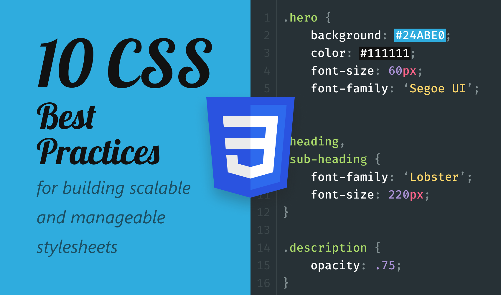
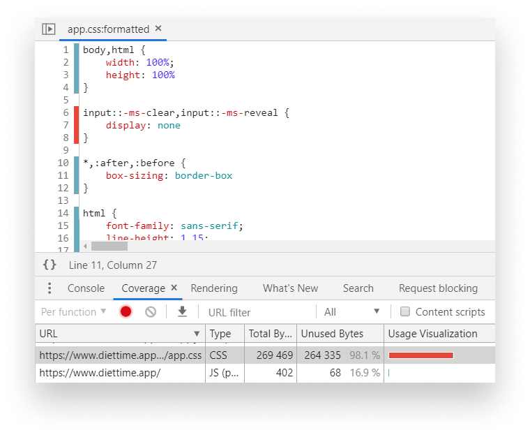
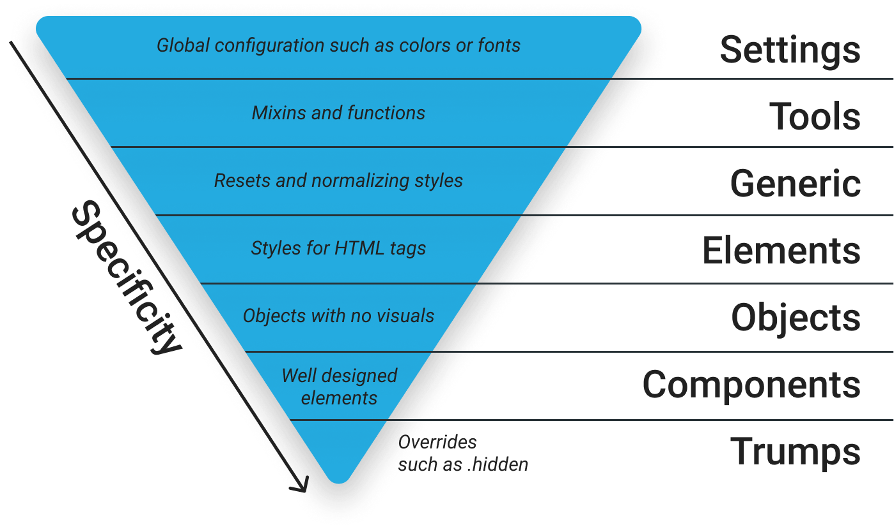
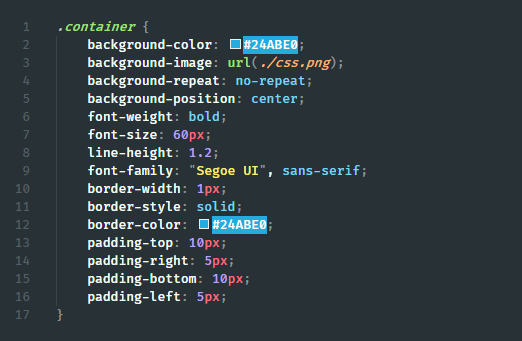
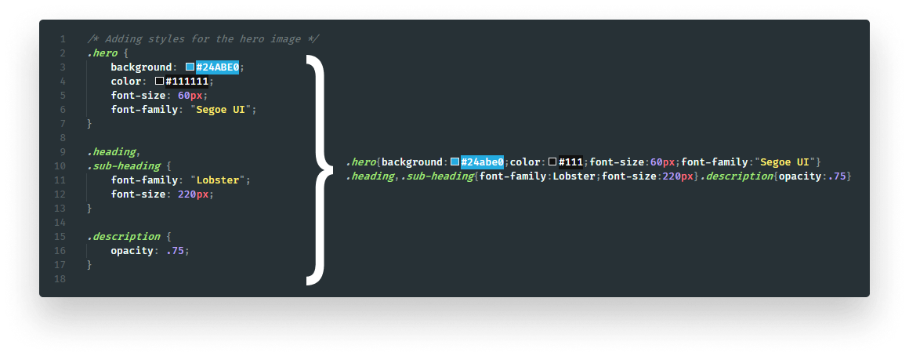
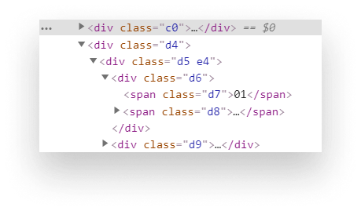

> 本文由 [简悦 SimpRead](http://ksria.com/simpread/) 转码， 原文地址 [juejin.cn](https://juejin.cn/post/6844904183401807879)

> *   原文地址：[10 Best Practices for Improving Your CSS](https://link.juejin.cn?target=https%3A%2F%2Fmedium.com%2Fbetter-programming%2F10-best-practices-for-improving-your-css-84c69aac66e "https://medium.com/better-programming/10-best-practices-for-improving-your-css-84c69aac66e")
> *   原文作者：[Ferenc Almasi](https://link.juejin.cn?target=https%3A%2F%2Fmedium.com%2F%40ferencalmasi "https://medium.com/@ferencalmasi")
> *   译文出自：[掘金翻译计划](https://link.juejin.cn?target=https%3A%2F%2Fgithub.com%2Fxitu%2Fgold-miner "https://github.com/xitu/gold-miner")
> *   本文永久链接：[github.com/xitu/gold-m…](https://link.juejin.cn?target=https%3A%2F%2Fgithub.com%2Fxitu%2Fgold-miner%2Fblob%2Fmaster%2Farticle%2F2020%2F10-best-practices-for-improving-your-css.md "https://github.com/xitu/gold-miner/blob/master/article/2020/10-best-practices-for-improving-your-css.md")
> *   译者：[febrainqu](https://link.juejin.cn?target=https%3A%2F%2Fgithub.com%2Ffebrainqu "https://github.com/febrainqu")
> *   校对者：[rachelcdev](https://link.juejin.cn?target=https%3A%2F%2Fgithub.com%2Frachelcdev "https://github.com/rachelcdev")、[lhd951220](https://link.juejin.cn?target=https%3A%2F%2Fgithub.com%2Flhd951220 "https://github.com/lhd951220")

改善 CSS 的 10 个最佳实践
=================



CSS 看起来是一种非常直接且不易犯错的语言。只需要添加规则以对网站进行样式设置就可以了，对吗？对于只需要几个 CSS 文件的小型站点，可能是这种情况。但是在大型程序中，这样可能会使样式迅速失控。如何让它们更可控？

事实是，就像其他任何语言一样，CSS 的细微差别可以使你的设计有天壤之别。这是 CSS 的 10 条技巧 —— 可以帮助你从样式中获得最大收益的最佳实践。

1. 你真的需要框架吗？
------------

首先，确定你是否真的需要使用 CSS 框架。现在有许多轻量级的方法可以替代繁重的框架。通常，你不会使用框架中的每个选择器，因此你的程序中会包含冗余代码。

如果你只需要使用按钮的样式，将它们复制到你自己的 CSS 文件中，然后删除其余的样式。另外，你可以使用开发者工具中的代码覆盖率检测来识别未使用的 CSS 规则。



要打开它，请在 “工具” 面板中搜索 Coverage。您可以通过单击 `Ctrl` + `Shift` + `P` 来打开工具面板。打开后，单击重新加载图标开始录制。所有显示红色的内容都是没有使用的。

你可以在上面的例子中看到，它表示了 98% 的 CSS 都没有被使用。请注意，实际上并非如此 —— 某些 CSS 样式仅在用户与网站互动后才应用。移动设备的样式也会被标记为未使用。因此，在删除所有内容之前，请确保这些样式确实没有在任何地方使用。

2. 选用一套 CSS 规范
--------------

考虑为你的项目使用一套 CSS 规范。CSS 规范使 CSS 文件具有一致性。它们有助于扩展和维护您的项目。这里有一些我推荐的 CSS 规范。

#### BEM

BEM —— Block（块）、Element（元素）、Modifier（修饰符）—— 是最流行的 CSS 规范之一。它是一组命名约定，你可以使用它们轻松地设计可复用组件。命名约定遵循以下模式：

```
.block { ... }
.block__element { ... }
.block--modifier { ... }
```

*   `.block`：块代表一个组件。它们是独立的实体，并且对自身有意义。
*   `.block__element`：这些是 `.block` 的一部分。它们没有独立的含义，必须绑定到一个块上。
*   `.block--modifier`：它们被用作块或元素的标志。我们可以使用它们来改变元素的外观、行为或状态。例如，要使用隐藏标记，我们可以命名为 `.block--hidden`。

#### ITCSS

倒三角 CSS 通过引入不同的层来实现不同的特性，帮助你更好地组织你的文件。你走得越深，就越具体。



#### OOCSS

Object-oriented CSS 或 OOCSS 遵循两个主要的原则。

**分离结构和视觉效果**

这意味着你要将视觉效果与结构代码分开定义。这在实践中意味着什么？

```
/* 待优化的内容  */
.box {
    width: 250px;
    height: 250px;
    padding: 10px;
    border: 1px solid #CCC;
    box-shadow: 1px 2px 5px #CCC;
    border-radius: 5px;
}

/* 优化后 */
.box {
    width: 250px;
    height: 250px;
    padding: 10px;
}

.elevated {
    border: 1px solid #CCC;
    box-shadow: 1px 2px 5px #CCC;
    border-radius: 5px;
}
```

**分隔容器和内容**

这意味着你不希望任何元素依赖于它的位置。相同的元素无论在页面的什么位置看起来都应该是相同的。

```
/* 待优化的内容 */
.main span.breadcumb { ... }

/* 优化后 */
.breadcrumb { ... }
```

3. 设置预处理器
---------

设置预处理器可以在很多方面给你带来好处。预处理器是一种工具，它允许你使用 CSS 中不存在的高级特性。这些特性可能是循环变量甚至函数之类的东西。

现在有很多预处理器。最著名的三个大概是 [Sass](https://link.juejin.cn?target=https%3A%2F%2Fsass-lang.com%2F "https://sass-lang.com/")、[Less](https://link.juejin.cn?target=http%3A%2F%2Flesscss.org%2F "http://lesscss.org/") 和 [Stylus](https://link.juejin.cn?target=https%3A%2F%2Fstylus-lang.com%2F "https://stylus-lang.com/")。我建议使用 Sass，因为它有一个成熟的社区，而且你可以在网上找到大量关于它的文档。

那么，预处理器能提供什么帮助？

#### 更好地组织样式

预处理可以帮你更好地组织样式。它们能够将你的文件拆解成更小的可复用文件。它们可以相互导入，或者分别导入你的应用。

```
// 为一个 SCSS 文件导入不同的模块
@import 'settings';
@import 'tools';
@import 'generic';
@import 'elements';
@import 'objects';
@import 'components';
@import 'trumps';
```

#### 嵌套选择器

另一种增强可读性的好方法是嵌套选择器。这是一个简单而强大但 CSS 所缺少的功能。

```
.wrapper {
    .sidebar {
        &.collapsed {
            display: none;
        }
        
        .list {
            .list-item {
                ...
                
                &.list-item--active {
                    ...
                }
            }
        }
    }
}
```

分层结构使我们更加清晰的看出不同元素的结合关系。

#### 自动为你的规则添加前缀

CSS 中有一些非标准或实验性功能的前缀。不同的浏览器为其使用不同的前缀，例如：

*   `-webkit-`：适用于基于 WebKit 的浏览器，例如 Chrome、Safari 或 Opera 的较新版本。
*   `-moz-`：适用于 Firefox。
*   `-o-`：适用于旧版 Opera。
*   `-ms-`：用于 IE 和 Edge。

为了支持所有主流浏览器，我们必须多次定义某些属性。

```
.gradient {
    background: rgb(30,87,153);
    background: -moz-linear-gradient(top, rgba(30,87,153,1) 0%, rgba(41,137,216,1) 50%, rgba(32,124,202,1) 51%, rgba(125,185,232,1) 100%);
    background: -webkit-linear-gradient(top, rgba(30,87,153,1) 0%, rgba(41,137,216,1) 50%, rgba(32,124,202,1) 51%, rgba(125,185,232,1) 100%);
    background: linear-gradient(to bottom, rgba(30,87,153,1) 0%, rgba(41,137,216,1) 50%, rgba(32,124,202,1) 51%, rgba(125,185,232,1) 100%);
    filter: progid:DXImageTransform.Microsoft.gradient(startColorstr='#1e5799', endColorstr='#7db9e8', GradientType=0);
}
```

预处理器可以解决此问题，它借助了 `mixin` —— 可以代替硬编码值使用的函数。

```
@mixin gradient() {
    background: rgb(30,87,153);
    background: -moz-linear-gradient(top, rgba(30,87,153,1) 0%, rgba(41,137,216,1) 50%, rgba(32,124,202,1) 51%, rgba(125,185,232,1) 100%);
    background: -webkit-linear-gradient(top, rgba(30,87,153,1) 0%, rgba(41,137,216,1) 50%,rgba(32,124,202,1) 51%, rgba(125,185,232,1) 100%);
    background: linear-gradient(to bottom, rgba(30,87,153,1) 0%, rgba(41,137,216,1) 50%,rgba(32,124,202,1) 51%, rgba(125,185,232,1) 100%);
    filter: progid:DXImageTransform.Microsoft.gradient(startColorstr='#1e5799', endColorstr='#7db9e8', GradientType=0);
}

.gradient {
    @include gradient();
}
```

在需要的时候添加 `mixin` 可以避免编写冗余代码。

#### 使用后处理器

更好的选择是后处理器。一旦 CSS 由预处理器生成，则后处理器可以运行其他优化步骤。最受欢迎的后处理器之一是 `[PostCSS](https://postcss.org/)`。

你可以使用 `PostCSS` 来自动为 CSS 规则添加前缀，就必担心会遗漏主要的浏览器。他们使用 [Can I Use](https://link.juejin.cn?target=https%3A%2F%2Fcaniuse.com%2F "https://caniuse.com/") 中的值，因此它始终保持最新的。

另一个很好的后处理器是 `[autoprefixer](https://www.npmjs.com/package/autoprefixer)`。使用 `autoprefixer`，当您要支持最新四个版本时 — 无需在 CSS 文件中写入任何前缀就可以完成所有工作！

```
const autoprefixer = require('autoprefixer')({
    browsers: [
	'last 4 versions',
	'not ie < 9'
    ]
});
```

#### 使用配置进行一致的设计

除了 `mixin`，你还可以选择使用变量。与 linter 一起，你可以强制执行自己的设计规则。

```
// 字体定义
$font-12: 12px;
$font-21: 21px;

// 颜色定义
$color-white: #FAFAFA;
$color-black: #212121;
```

4. 使用标签代替 CSS
-------------

现在让我们进入实际的 CSS 应用。这经常被忽略。通常，你可以简单地通过使用正确的 HTML 标签来减小 CSS 包的大小。假设你的标题包含以下规则：

```
span.heading {
    display: block;
    font-size: 1.2em;
    margin-top: 1em;
    margin-bottom: 1em; 
}
```

你使用了一个 `span` 标签作为标题。你重写了默认的显示、间距和字体样式。这可以通过使用 `h1`、`h2` 或 `h3` 来避免。默认情况下，它们具有你试图用其他标签达到的样式。你可以立即少写四条不必要的样式规则。

5. 使用简写属性
---------

为了进一步减少样式规则数量，通常使用 [简写属性](https://link.juejin.cn?target=https%3A%2F%2Fdeveloper.mozilla.org%2Fen-US%2Fdocs%2FWeb%2FCSS%2FShorthand_properties "https://developer.mozilla.org/en-US/docs/Web/CSS/Shorthand_properties")。对于上面的示例，我们可以写：

```
.heading {
    margin: 1em 0;
}
```

对于其他属性，如边框、边框或背景，也是如此。



6. 减少冗余
-------

这与上一点是密切相关的。有时很难发现冗余，特别是当两个选择器中的重复规则未遵循相同顺序时。但是，如果你的类仅在一个或两个规则中有所不同，最好将这些规则外包出去，作为一个额外的类使用。这是优化前的代码：

```
<style>
    .warning {
        width: 100%;
        height: 50px;
        background: yellow;
        border-radius: 5px;
    }

    .elevated-warning {
        width: 100%;
        height: 50px;
        font-size: 150%;
        background: yellow;
        box-shadow: 1px 2px 5px #CCC;
        border-radius: 5px;
    }
</style>

<div class="warning">⚠️</div>
<div class="elevated-warning">🚨</div>
```

试着用类似的方法：

```
<style>
    .warning {
        width: 100%;
        height: 50px;
        background: yellow;
        border-radius: 5px;
    }

    .warning--elevated {
        font-size: 150%;
        box-shadow: 1px 2px 5px #CCC;
    }
</style>

<div class="warning">⚠️</div>
<div class="warning warning--elevated">🚨</div>
```

7. 避免使用复杂的选择器
-------------

使用复杂的选择器有两个主要问题。首先，增加的特性不仅会使以后重写现有规则变得更加困难，还会增加浏览器匹配选择器所需的时间。

#### 匹配选择器

当浏览器解析选择器并确定它与哪个元素匹配时，它们是[从右到左](https://link.juejin.cn?target=https%3A%2F%2Fstackoverflow.com%2Fquestions%2F5797014%2Fwhy-do-browsers-match-css-selectors-from-right-to-left%2F5813672%235813672 "https://stackoverflow.com/questions/5797014/why-do-browsers-match-css-selectors-from-right-to-left/5813672#5813672")进行的。就性能而言，这比相反的方式更快。让我们以下面的选择器为例。

```
.deeply .nested .selector span {
    ...
}
```

浏览器将首先从 `span` 开始。它将匹配所有 `span` 标签，然后转到下一个匹配项。它将过滤掉 `.selector` 类中的 `span`，以此类推。

不建议使用 CSS 的标签选择器，因为它会匹配所有的标签。虽然只有几分之一毫秒的差异，但积少成多。另一个更重要的原因是，减少选择器复杂性是一种好习惯。

#### 理解选择器

不仅机器很难进行解析，人类也难以理解。以如下为例：

```
[type="checkbox"]:checked + [class$="-confirmation"]::after {
    ...
}
```

你认为上述规则什么时候适用？通过创建自定义类并使用 JavaScript 进行切换，可以简化此过程。

```
.confirmation-icon::after {
    ...
}
```

现在看起来舒服多了。如果你发现自己仍然需要过于复杂的选择器，而且你相信没有其他选择，请在下面留下你的评论解释你的解决方案。

```
/**
 * 选中复选框后创建确认图标。
 * 选择所有以类名“-confirmation”结尾的标签
 * 前面有一个选中的复选框。
 * PS.：没有其他方法可以解决此问题，请不要尝试修复它。
 **/
.checkbox:checked + label[class$="-confirmation"]::after {
    ...
}
```

8. 不要删除轮廓
---------

这是开发人员在编写 CSS 时最常犯的错误之一。虽然你可能认为删除轮廓创建的高亮没有什么错，但事实上，你正在使网站无法访问。通常将此规则添加为 CSS 的重置值。

```
:focus {
    outline: none;
}
```

然而，这样的话，那些只能用键盘导航的用户将对网站聚焦的地方和内容一无所知。


如果默认样式对你的品牌不利，请创建自定义轮廓。只要确保在聚焦元素方面有某种指示即可。

9. 以移动设备优先
----------

当你必须处理媒体查询时，请始终使用移动设备优先。以移动设备为先的方法意味着当你开始编写 CSS 时，需要以小屏幕开发为基础，然后再扩展到其他设备。这也称为渐进增强。

这将确保你主要添加额外的规则来迎合大屏幕设备，而不是重写现有的 CSS 规则。这样可以减少最终使用的规则数量。

您如何判断是否使用移动优先？如果你的媒体查询使用 `min-width`，你就在正确的轨道上。

```
/* 移动优先的媒体查询，所有 600px 以上的设备都会获得以下样式 */
@media (min-width: 600px) {
    /* 你的CSS规则 */
}

/* 非移动优先媒体查询，所有 600px 以下的设备都会获得以下样式 */
@media (max-width: 600px) {
    /* 你的CSS规则 */
}
```

10. 压缩
------

最后，压缩文件包以减少它们的大小。因为压缩过程删除了注释和空白字符，所以文件包只需更少的宽带就能获取。



如果还没有，也可以在服务器端启用压缩。

进一步减小 CSS —— **和标记** —— 大小的另一种好方法是混淆类名。



为此，你可以根据项目设置选择几个选项：

*   **Webpack**：对于 Webpack，可以使用 `[css-loader](https://github.com/webpack-contrib/css-loader)` 模块。
*   **Gulp**: 对于 Gulp，可以使用 `[gulp-minify-cssnames](https://www.npmjs.com/package/gulp-minify-cssnames)` 插件。
*   **自定义**: 如果你没有用于项目设置的专用软件包，那么我会提供一个教程，向你展示如何创建 [自己的实现](https://link.juejin.cn?target=https%3A%2F%2Fmedium.com%2Fswlh%2Fhow-i-reduced-my-css-bundle-size-by-more-than-20-76433e7330eb "https://medium.com/swlh/how-i-reduced-my-css-bundle-size-by-more-than-20-76433e7330eb").

总结
--

遵循以上 10 个简单步骤将有助于你编写有以下优点的 css 文件：

*   更轻巧
*   易于维护
*   易于扩展

不仅如此，使用一些实用工具，如预定义的调色板或排版规则，将帮助您创建更稳定的设计。你的样式复用性也将更高，你就可以为下一个项目节省时间。

还有哪些未在本文提及，而你遵循的 CSS 最佳实践呢？在评论中告诉我们！

感谢你花时间阅读本文，祝你愉快！

> 如果发现译文存在错误或其他需要改进的地方，欢迎到 [掘金翻译计划](https://link.juejin.cn?target=https%3A%2F%2Fgithub.com%2Fxitu%2Fgold-miner "https://github.com/xitu/gold-miner") 对译文进行修改并 PR，也可获得相应奖励积分。文章开头的 **本文永久链接** 即为本文在 GitHub 上的 MarkDown 链接。

> [掘金翻译计划](https://link.juejin.cn?target=https%3A%2F%2Fgithub.com%2Fxitu%2Fgold-miner "https://github.com/xitu/gold-miner") 是一个翻译优质互联网技术文章的社区，文章来源为 [掘金](https://juejin.cn "https://juejin.cn") 上的英文分享文章。内容覆盖 [Android](https://link.juejin.cn?target=https%3A%2F%2Fgithub.com%2Fxitu%2Fgold-miner%23android "https://github.com/xitu/gold-miner#android")、[iOS](https://link.juejin.cn?target=https%3A%2F%2Fgithub.com%2Fxitu%2Fgold-miner%23ios "https://github.com/xitu/gold-miner#ios")、[前端](https://link.juejin.cn?target=https%3A%2F%2Fgithub.com%2Fxitu%2Fgold-miner%23%25E5%2589%258D%25E7%25AB%25AF "https://github.com/xitu/gold-miner#%E5%89%8D%E7%AB%AF")、[后端](https://link.juejin.cn?target=https%3A%2F%2Fgithub.com%2Fxitu%2Fgold-miner%23%25E5%2590%258E%25E7%25AB%25AF "https://github.com/xitu/gold-miner#%E5%90%8E%E7%AB%AF")、[区块链](https://link.juejin.cn?target=https%3A%2F%2Fgithub.com%2Fxitu%2Fgold-miner%23%25E5%258C%25BA%25E5%259D%2597%25E9%2593%25BE "https://github.com/xitu/gold-miner#%E5%8C%BA%E5%9D%97%E9%93%BE")、[产品](https://link.juejin.cn?target=https%3A%2F%2Fgithub.com%2Fxitu%2Fgold-miner%23%25E4%25BA%25A7%25E5%2593%2581 "https://github.com/xitu/gold-miner#%E4%BA%A7%E5%93%81")、[设计](https://link.juejin.cn?target=https%3A%2F%2Fgithub.com%2Fxitu%2Fgold-miner%23%25E8%25AE%25BE%25E8%25AE%25A1 "https://github.com/xitu/gold-miner#%E8%AE%BE%E8%AE%A1")、[人工智能](https://link.juejin.cn?target=https%3A%2F%2Fgithub.com%2Fxitu%2Fgold-miner%23%25E4%25BA%25BA%25E5%25B7%25A5%25E6%2599%25BA%25E8%2583%25BD "https://github.com/xitu/gold-miner#%E4%BA%BA%E5%B7%A5%E6%99%BA%E8%83%BD")等领域，想要查看更多优质译文请持续关注 [掘金翻译计划](https://link.juejin.cn?target=https%3A%2F%2Fgithub.com%2Fxitu%2Fgold-miner "https://github.com/xitu/gold-miner")、[官方微博](https://link.juejin.cn?target=http%3A%2F%2Fweibo.com%2Fjuejinfanyi "http://weibo.com/juejinfanyi")、[知乎专栏](https://link.juejin.cn?target=https%3A%2F%2Fzhuanlan.zhihu.com%2Fjuejinfanyi "https://zhuanlan.zhihu.com/juejinfanyi")。